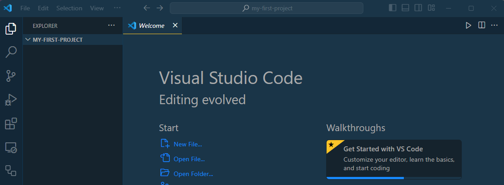
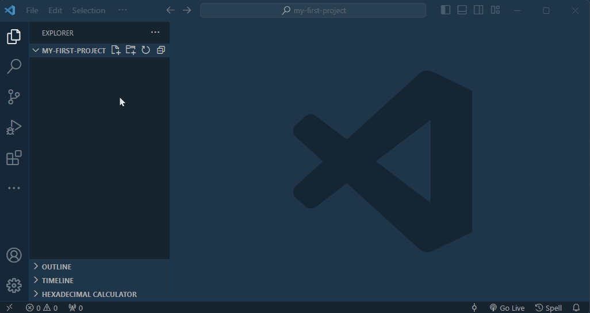
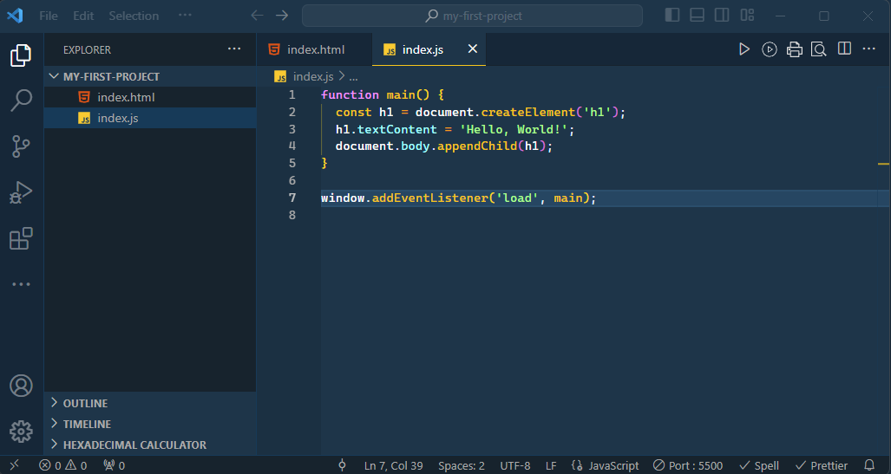

# VSCode Tips

## Installation

Download and install the appropriate version of VSCode for your operating system from the [VSCode web site](https://code.visualstudio.com/).

## Some useful extensions

VSCode can be extended with _extensions_.

> There are many extensions available that you could possibly install. Browsing through the long list of the VSCode Extensions Marketplace might make you feel like a child in a candy store, with all this free stuff ready for the taking. However, we urge you to resist the temptation and just install the extensions recommended below. Other extensions may interfere with the essential ones recommended here. Once you gain more experience you may choose to install additional ones, but in all cases you should only do so when you have an immediate, identifiable use case for each one.  

There are four extension that we recommend you install from day 1.

1. **Code Spell Checker**. We fully understand that you guys sometimes have difficulty with the correct English spelling when choosing names for variables and functions in your JavaScript programs. That is nothing to be ashamed of, but why not get some help from a handy extension?

2. **ESLint**. This extension can check your JavaScript code for obvious errors, such as undefined variables, unused variables, etc.

3. **Prettier - Code formatter**. Prettier is an code formatter that enforces a consistent style by parsing your code and re-printing it with its own rules that take the maximum line length into account, wrapping code when necessary.

   > If you have any other code formatter extensions installed, e.g., **Beautify**, be sure to remove them as they may conflict with **Prettier**.

4. **Live Server**. Launch a development local Server with live reload feature for static & dynamic pages.

### VSCode Setup Instructions

1. Start up VSCode.

2. Press the button in the area in the left margin (called the **Activity Bar**), as shown below:

   

3. In the input field in the upper left corner, type `spell checker` as pictured here:

   

4. Press the `Install` button of **Code Spell Checker**.

5. Install the remaining extensions by repeating steps 3 and 4, by typing the names of the extensions:

   - **ESLint**
   - **Prettier - Code formatter**
   - **Live Server**

6. You now need to install a global Node package to support ESLint. Open a terminal window in VSCode by selecting **View**, **Integrated Terminal** from the menu bar.

7. A terminal window opens in the lower half of the VSCode window. In this window, type the command below (on Linux and MacOS systems you may need to prefix this command with `sudo`, e.g. `sudo npm ...`):

   ```text
   npm install -g eslint
   ```

## Customise VSCode Settings

We recommend that you apply a couple of changes to the default settings of VSCode to help you create well-formatted JavaScript code. Follow these steps:

1. Press the function key <kbd>F1</kbd> and type the following in the text box:

    ```text
    open settings
    ```

    A menu will appear with matching menu options:

   

2. Select **Preferences: Open User Settings (JSON)** from the list

3. Copy the content shown below and paste it over (i.e. replace) the existing content.

    ```json
    /// Place your settings in this file to overwrite the default settings
    {
      "editor.detectIndentation": false,
      "editor.formatOnSave": true,
      "editor.minimap.enabled": false,
      "editor.tabSize": 2,
      "editor.codeActionsOnSave": {
        "source.fixAll": "explicit"
      },
      "files.autoSave": "onFocusChange",
      "prettier.trailingComma": "es5",
      "editor.defaultFormatter": "esbenp.prettier-vscode",
      "[javascript]": {
        // override possible JavaScript specific user setting
        "editor.defaultFormatter": "esbenp.prettier-vscode"
      },
      "editor.bracketPairColorization.enabled": true,
      "editor.guides.bracketPairs": true,
      "editor.guides.highlightActiveIndentation": true,
      "editor.guides.bracketPairsHorizontal": "active"
    }
    ```

4. Close the Settings tabs.

## Configuring the Default Shell (Windows users only)

By default, a VSCode installation on Window uses **PowerShell** for the Integrated Terminal. To change this to **Git Bash**, follow these steps:

1. Press the key combination <kbd>F1</kbd> to open the VSCode Command Pallette.
2. Type the words: `select default`
3. From the drop-down menu, select **Terminal: Select Default Profile**
4. A new drop-down menu will appear. From this menu, select **Git Bash**.

## Using VSCode

You’ll get the most out of VSCode if you organise your work in **project folders**.

Later in the course you will be “cloning” Git repositories into local folders as the basis for your homework or projects. But for now, if you do not yet have a project folder you should create one first.

A nice way to organise your project folders is to create a parent folder where you will keep all project folders. For instance, you could create a `hackyourfuture` folder in your home directory to serve as the parent directory. Then, inside that parent directory, create a project folder, say `my-first-project`.

> Note: Do not use spaces in file and folder names. Names with spaces often require special treatment ("quoting") when referring to them in the command line and this is best avoided.

Once you have created the project folder you have two options to open VSCode. If you are on the command line you can `cd` to your project folder and type the command:

```text
code .
```

Alternatively, you can first open VSCode application and then use the **Open Folder** button or the **File, Open Folder...** menu command to open the project folder.


> Make it a habit in VSCode to always open the main folder that contains the project you are working on, rather than individual files or subfolders inside that folder.

In the figure below the folder named `my-first-project` was opened in VSCode. The directory tree (still empty) for that folder in shown in the **Explorer** panel. The folder name `MY-FIRST-PROJECT` is displayed in uppercase in the title bar of the directory tree panel.



## Creating a new HTML file

You are now ready to start adding your first HTML file.

1. Open the folder where you will keep your working files, for instance `my-first-project`.

2. Right-click in an empty space in the `EXPLORER` window and select **New File** from the context menu, or alternatively, click on the `New File...` button as shown in the screen animation below. Then, type the name of the file, `index.html` and press <kbd>Enter</kbd>.

   

   As can be seen in the animation, you can quickly create a skeleton HTML file by typing an exclamation mark followed by pressing the <kbd>Tab</kbd> key.

3. To complete the files for your first project, create an `index.js` to contain your JavaScript code. A simple file with rudimentary DOM manipulation might look like this:

    

4. To try it out in a browser, right click on the `index.html` file in the `EXPLORER` window and select the **Open with Live Server** menu option.

Notes:

- Be on the watch out for coloured squiggly underlines in your code. These are warnings from either **ESLint** or the **Spell Checker** that something might be wrong. If you see such squiggly underlines, hover your mouse pointer over the underlined text and a tooltip will appear that explains what might be wrong.

- You can also open the `PROBLEM` panel by selecting **View**, **Problems** from the menu to inspect the reported problems, if any.

- The left-hand part of the VSCode status bar gives an indication of the number of errors and warnings issued.

    | Symbol | Meaning  |
    |:------:|----------|
    | ⨂ _n_ | Number of errors |
    | ⚠ _n_ | Number of warnings |

## Some Useful Short-Cut Commands

In the previous section we frequently referred you to the menu bar to select commands. As you get more proficient with VSCode you may want to inspect these menus a little closer and take note of the short-cut commands listed in their right margin. For example, the short-cut command for **File**, **New** is listed as Ctrl+N (press `Ctrl` and `N` keys simultaneously) on a Windows or Linux PC and ⌘N on a Mac.

Here are some short-cut commands that you will use many times a day and that we recommend you familiarise yourself with from day 1:

| Operation                                                        | Windows     | Mac | Linux        |
| ---------------------------------------------------------------- | ----------- | --- | ------------ |
| **Format Document** (make it pretty)                             | Shift‑Alt‑F | ⇧⌥F | Ctrl‑Shift‑I |
| **Search** (Find)                                                | Ctrl+F      | ⌘F  | Ctrl+F       |
| **Replace** (Find and replace)                                   | Ctrl+H      | ⌥⌘F | Ctrl+H       |
| **Rename Symbol** (change all names in file to a different name) | F2          | F2  | F2           |
| Open an **Integrated Terminal** window in VSCode                 | Ctrl+'      | ⌃\` | Ctrl+'       |

- **Format Document**. This command reformats your JavaScript file in a generally accepted standard format, using proper indenting, proper use of spaces, placing of curly braces and more. A neatly formatted document helps you to better understand your own code and your teachers, mentors and fellow students will love your for it too when they review your work.

  _With VSCode at your finger tips there is no longer any excuse for submitting poorly formatted homework!_

- **Search**. Search for specified text.
- **Replace**. Replace specified text by some other text.

  In the figure below the **Replace** pop-up window is shown. The **Search** pop-up is similar, but with one input field only.

  

  - The `Aa` button activates the **Match Case** option.
  - The <u>`ab`</u> button matches **Whole Words Only**.
  - The `.*` button allow you to search using _regular expressions_, which you may encounter in later modules as an advanced JavaScript programming topic.
  - The `b-C` button next to the second input field replaces the next occurrence of the matched text.
  - The adjacent `ab-BC` button replaces **all** occurrences of the matched text.
  - The up and down arrows move the cursor to the previous and next match.
  - To get rid of the pop-up press `Esc` or press the `x` button.

- **Rename Symbol**. This command renames all occurrences of a JavaScript variable or function name. To do so, move the text cursor to the variable or function name and press F2. A small pop-up window will appear in which you can type a new name. Press Enter to finalise the change or Esc to cancel it.

- **Open an Integrated Terminal window**. We already covered this when we mentioned the **View**, **Integrated Terminal** menu command.

### Further information

Please note that VSCode is actively being developed. At present there is a monthly release cycle, so don't be surprised when you are prompted once a month to update to the latest version. We advise you to update when prompted (naturally, not when you are in the middle something that you don't want interrupted).

You can find detailed information about VSCode at the [VSCode web site](https://code.visualstudio.com/docs).
