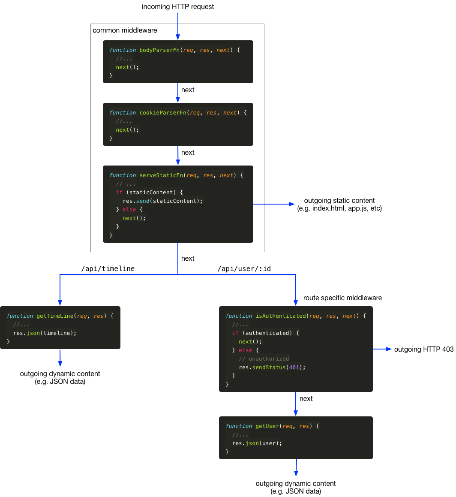

# Express

## Purpose

This article gives an overview of Express and how it can be used to build complex HTTP server applications based on the Node.js `http` module.

## A simple Express server

Let's create a simple Express server with Node:

```js
const http = require('http');
const express = require('express');
const app = express();

http.createServer(app)
  .listen(3000, () => {
    console.log('Express server listening on port 3000');
  });
```

So, what is `app` here? The `http.createServer()` function is part of the Node.js `http` module. Inspection of the Node.js documentation shows that `createServer()` expects a **request listener** as its argument. This is a function that takes two arguments: a request object and a response object, named here respectively: `req` and `res`.

```js
function requestListener(req, res) {
  // ...
}
```

Therefore, `app` must be (and actually is) a request listener function:

```js
function app(req, res) {
  // ...
}
```

But actually, `app` is far more than that. The Express package adds number of properties to the `app` function. Remember that a JavaScript function is in essence a JavaScript object, although one of a special type. You can add properties to any JavaScript object, including to function objects, such as `app` here.

Below is a simplified representation of the internals of Express:

```js
// Simplified internal implementation of the 'express' Node module

function createApplication() {
  const app = function(req, res) {
    // ...
  }
  
  app.use = function use(...middleWareFns) {
    // adds middleware shared across all routes
  };

  app.get = function get(path, ...middleWareFns) {
    // adds middleware for the GET method for a specific route
  }

  // etc.

  return app;
}

module.exports = createApplication;
```

## A real world Express application

Figure 1 below shows a real world (though trimmed down) example of an Express application (this one is taken from the **Hyfer** application). We will dissect this code snippet in the next sections.

```js
const http = require('http');
const express = require('express');
const compression = require('compression');
const bodyParser = require('body-parser');
const cookieParser = require('cookie-parser');
const serveStatic = require('serve-static');

const app = express();

// shared middleware for all routes
app.use(bodyParser.json());
app.use(cookieParser());
app.use(serveStatic('./public'));

// route specific request handlers
app.get('/api/timeline', getTimeLine);
app.get('/api/user/:id', isAuthenticated, getUser);

http.createServer(app)
  .listen(3000, () => {
    console.log('Express server listening on port 3000');
  });

// example request handler implementations

function getTimeLine(req, res) {
  //...
  res.json(timeline);
}

function getUser(req, res) {
  //...
  res.json(user);
}

function isAuthenticated(req, res, next) {
  //...
  if (authenticated) {
    next();
  } else {
    // unauthorized
    res.sendStatus(401);
  }
}
```

Listing 1: A real world Express application

## Middleware

In the Express documentation the term **middleware** is used to describe a special type of request handler. It has the following [function signature](https://developer.mozilla.org/en-US/docs/Glossary/Signature/Function):

```js
function middlewareFn(req, res, next) {
  // ...
}
```

Note that a third parameter, `next` is added to the function signature. This `next` parameter is a function that takes no parameters.

Express constructs a pipeline of middleware functions through which an incoming HTTP request (`req`) is routed and an outgoing HTTP response (`res`) is sent back.

Each middleware function is expected to either pass on the request to the next function in the pipeline, i.e. by calling `next()`, or send a response itself. In the latter case, handling of the request ends there and then. Otherwise the next middleware function in the pipeline is called.

Middleware functions can (and usually do) make change to the request object, the response object or both, before passing them on. In fact, this is the main purpose of middleware: adding functionality and information as the request progresses through the pipeline.

Ultimately there must be some middleware function in the pipeline that sends a response. If not, the client will time out with an error.

Figure 1 below illustrates the middleware configuration of Listing 1 above.



Figure 1. Express middleware pipeline representation of Listing 1 code.

All incoming requests are routed through the common middleware functions added and configured through `app.use()`. Next, the requests are routed to middleware functions based on the request method (e.g. a `GET`) and request path (e.g. `/api/timeline`). These functions are usually added and configured through `app.get()`, `app.post()`, etc.

Application specific routes are ultimately handled by request handlers at leaf nodes of the pipeline. Because they are leaf nodes, they usually leave out the `next` parameter, as there is no 'next' to pass the request on to. 

### Conditional middleware

In Listing 1 and Figure 1 there are two middleware functions that conditionally call `next()`. 

1. The first one comes from the [serve-static](https://github.com/expressjs/serve-static) middleware. This middleware checks whether the requested URL corresponds to a file (e.g. `index.html`) in the server folder designated for hosting static content. If so, this file is served as the response. If not, the middleware function calls `next()` to continue the pipeline.

2. The second one in this example is the function `isAuthenticated()` which test whether the requesting user is authenticated (details on how this is done is left out here). If the requesting user is an authenticated user, then, the request is allowed to pass through. Otherwise an `HTTP 401 - Unauthorized` is sent back, without allowing the request to continue.

## Further reading

There is far more to Express than can be covered in this article.

- [Official Express site](https://expressjs.com/)
- [HTTP request methods](https://developer.mozilla.org/en-US/docs/Web/HTTP/Methods)
- [HTTP response status codes](https://developer.mozilla.org/en-US/docs/Web/HTTP/Status)
